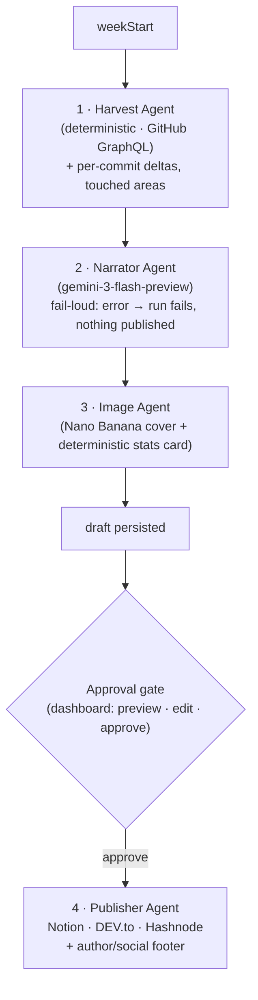

# DevNotion

**Turn your weekly GitHub activity into a polished, illustrated blog post — narrated by an LLM, reviewed by you, and published to Notion, DEV.to, and Hashnode.**

DevNotion is a [Mastra](https://mastra.ai) pipeline of specialist agents: it harvests a week of your GitHub work, narrates it into a first-person post, generates images, and lets you preview/edit before it publishes anywhere. Originally built for the DEV.to × Notion MCP Challenge (where it won $500); **v2** was rebuilt for the [GitHub Finish-Up-A-Thon](https://dev.to/challenges/github-2026-05-21) with multi-LLM support, a review dashboard, image generation, richer harvesting, and a fail-safe publishing flow.

## What's new in v2

| | v1 | v2 |
|---|---|---|
| **LLM** | Gemini only | Gemini · OpenAI · Anthropic (provider abstraction; default `gemini-3-flash-preview`) |
| **Publish targets** | Notion + DEV.to | Notion + DEV.to + **Hashnode** |
| **Flow** | generate → publish immediately | **generate → preview → edit → approve → publish** |
| **UI** | none (CLI/cron) | **web dashboard** (trigger, preview, edit, history) |
| **Images** | none | **AI cover (Nano Banana) + deterministic stats card** |
| **Harvest** | PR-only line stats | **real per-commit deltas, changed files, touched areas** |
| **Footer** | none | **author/social footer** on every post |
| **Failure** | silent fallback could publish a stub | **fail-loud** — a bad run publishes nothing |
| **Setup** | hand-edit `.env` | `npx devnotion init` guided wizard |

## Architecture

Four specialist agents across a pipeline that is split so generation and publishing are decoupled — a failure or an unreviewed draft never reaches your readers.



The pipeline only uses an LLM where it adds value (narration, cover). Harvest, the stats card, and publishing are deterministic — no token overhead, no hallucinated numbers.

## Key features

- **Multi-LLM** — set `LLM_PROVIDER=gemini|openai|anthropic`. Default model is `gemini-3-flash-preview` (free tier eligible). One source of truth for model selection.
- **Preview → edit → publish gate** — the dashboard generates a draft, shows it (with images) for review and in-browser markdown editing, and publishes only on **Approve**. The headless/cron path can default to drafts.
- **Diff-enriched harvest** — real per-repo/commit line deltas, changed-file counts, commit messages, and the top directories you touched (e.g. `src/server`) — so the narration is specific, not generic.
- **Images** — an AI cover via `gemini-2.5-flash-image` ("Nano Banana"), plus a deterministic stats card (SVG → PNG) with the week's exact numbers. Image generation is best-effort and never blocks a run.
- **Author/social footer** — name, bio, and links rendered on every post from one config (`src/config/author.ts`).
- **Fail-loud** — if narration hits a quota/parse error, the run is marked failed and nothing is published (no silent fallback stub).
- **Rate-limited & resilient** — `p-queue` + `p-retry` wrappers per API (Notion, DEV.to, Hashnode, GitHub).

## Quick Start

### Prerequisites
- Node.js 22+, pnpm
- GitHub personal access token (`ghp_…`, scopes: `read:user`, `repo`, `read:org`)
- An LLM key: Google AI Studio ([free keys](https://aistudio.google.com)), or OpenAI, or Anthropic
- Notion integration token + parent page ID ([setup](https://developers.notion.com/docs/create-a-notion-integration))
- Optional: DEV.to API key, Hashnode token + publication ID

### Setup

```bash
git clone https://github.com/yashksaini-coder/DevNotion.git
cd DevNotion
pnpm install
npx devnotion init   # guided wizard — validates each credential as you enter it
```

`init` writes a `.env.local` and live-checks GitHub, your LLM provider, Notion, and any publish targets you enable. (Or copy `.env.example` to `.env.local` and fill it in by hand.)

### Run

```bash
pnpm dashboard                 # web dashboard at http://localhost:3000 (recommended)
pnpm dev                       # run the pipeline for the current week (CLI)
pnpm dev -- --week=2026-03-16  # run for a specific week
pnpm playground                # Mastra playground (agent testing UI)
pnpm test                      # vitest suite
```

The **dashboard** is the main entry point: trigger a run, watch it reach *Preview Ready*, review/edit the post and images, then **Approve & Publish**.

### CI (GitHub Actions)

Runs automatically every Sunday at 08:00 UTC, or manually via **Actions → Weekly Blog Dispatch → Run workflow**. Required secrets: `GH_TOKEN`, `GH_USERNAME`, `GOOGLE_API_KEYS`, `NOTION_TOKEN`, `NOTION_PARENT_PAGE_ID`, and any publish-target keys.

## Configuration (selected env)

```bash
LLM_PROVIDER=gemini                  # gemini | openai | anthropic
# LLM_MODEL=gemini-3-flash-preview   # override the per-provider default
# NARRATION_MAX_TOKENS=8192          # output budget (Gemini 3 is a thinking model)
PUBLISH_TARGETS=notion,devto         # comma-separated: notion, devto, hashnode
PUBLISH_MODE=auto                    # auto = publish live | draft = save as drafts
BLOG_TONE=casual                     # casual | professional | technical | storytelling
# FOCUS_AREAS=TypeScript performance,open source
# GENERATE_IMAGES=true               # cover + stats card
# IMAGE_PUBLIC_BASE_URL=             # public base URL so images attach on publish
# DASHBOARD_TOKEN=                   # optional bearer token to protect the dashboard
```

> **Note on images:** the AI cover uses `gemini-2.5-flash-image`, which needs image-generation quota (billing) on your Google project; without it the cover is skipped gracefully and the deterministic stats card is still produced.

## Blog Tone Profiles

| Tone | Style |
|------|-------|
| `casual` | First-person, playful, OSS-passionate dev energy |
| `professional` | Confident builder, clear and direct |
| `technical` | Deep-dive, architecture-focused, conversational |
| `storytelling` | Personal dev diary, honest and engaging |

## Tech Stack

- **[Mastra](https://mastra.ai)** — agent/workflow framework (+ Notion MCP in the playground)
- **[Vercel AI SDK](https://ai-sdk.dev)** — unified LLM + image generation (`@ai-sdk/google` · `openai` · `anthropic`)
- **Gemini 3 Flash** (narration) · **Nano Banana** (cover) · **@resvg/resvg-js** (stats card)
- **[Notion API](https://developers.notion.com)** · **[DEV.to API](https://developers.forem.com/api)** · **[Hashnode GraphQL](https://apidocs.hashnode.com/)**
- **Express** dashboard · **Zod** · **Vitest** · **GitHub Actions** (weekly cron + manual dispatch)

---

## Blog Log

| Week | Headline | Repos | Commits | PRs | Issues | Reviews | Lines Changed | Languages | Notion | DEV.to |
|------|----------|-------|---------|-----|--------|---------|---------------|-----------|--------|--------|
| 2026-05-25 | Polishing the Rust CLI and Planning the Long Game | 5 | 39 | 11 | 50 | 0 | +970/-279 | Python, TypeScript, Rust | [View](https://www.notion.so/Week-of-2026-05-25-5-repos-11-PRs-371293ab6e62813e8186dc52be6045f6) | [Draft](https://dev.to/yashksaini/polishing-the-rust-cli-and-planning-the-long-game-2ih7-temp-slug-6994430) |
| 2026-05-18 | From Rust CLI bug-hunting to a massive Portfoli... | 4 | 23 | 3 | 1 | 0 | +4,614/-1,081 | Python, TypeScript, Rust | [View](https://www.notion.so/Week-of-2026-05-18-4-repos-3-PRs-36a293ab6e6281429268fd6a227be67b) | [Draft](https://dev.to/yashksaini/from-rust-cli-bug-hunting-to-a-massive-portfolio-overhaul-293f-temp-slug-7129685) |
| 2026-05-11 | Shipping Docs, Rust Tooling, and a Week of Deep... | 3 | 14 | 2 | 1 | 5 | +1,573/-161 | Python, TypeScript, Rust | [View](https://www.notion.so/Week-of-2026-05-11-3-repos-2-PRs-363293ab6e6281d5b1c3ca65466f3c5d) | [Draft](https://dev.to/yashksaini/shipping-docs-rust-tooling-and-a-week-of-deep-reviews-m28-temp-slug-1477735) |
| 2026-05-04 | Agentic SRE and the 30-Review Marathon | 3 | 15 | 9 | 1 | 30 | +54,944/-39,021 | Python, TypeScript, Rust | [View](https://www.notion.so/Week-of-2026-05-04-3-repos-9-PRs-35c293ab6e62813a9f72d2fca79e3ea9) | [Draft](https://dev.to/yashksaini/agentic-sre-and-the-30-review-marathon-2f6g-temp-slug-8065105) |
| 2026-04-27 | Shipped VictoriaLogs support and survived a 24-... | 8 | 39 | 3 | 7 | 24 | +2,009/-21 | Python, TypeScript, Rust | [View](https://www.notion.so/Week-of-2026-04-27-8-repos-3-PRs-355293ab6e62813ba82dd9586a9f1ae1) | [Draft](https://dev.to/yashksaini/shipped-victorialogs-support-and-survived-a-24-review-marathon-3lmn-temp-slug-8455727) |
| 2026-04-20 | Networking Deep Dives and Scaling Docs: My 30k ... | 5 | 16 | 13 | 4 | 13 | +29,945/-711 | Python, TypeScript, Rust | [View](https://www.notion.so/Week-of-2026-04-20-5-repos-13-PRs-34e293ab6e6281d2861fc2abba9bab51) | [Draft](https://dev.to/yashksaini/networking-deep-dives-and-scaling-docs-my-30k-line-week-in-oss-3nb0-temp-slug-7870585) |
| 2026-04-13 | Building a Claude-style SRE terminal and tackli... | 4 | 11 | 5 | 1 | 3 | +11,185/-201 | Python, TypeScript, Rust | [View](https://www.notion.so/Week-of-2026-04-13-4-repos-5-PRs-347293ab6e6281c49052c2876148c104) | [Draft](https://dev.to/yashksaini/building-a-claude-style-sre-terminal-and-tackling-webrtc-for-py-libp2p-54m8-temp-slug-42067) |
| 2026-04-06 | Scaling RCA with MariaDB and MongoDB Atlas: A W... | 7 | 33 | 2 | 0 | 0 | +3,221/-27 | Python, TypeScript, Rust | [View](https://www.notion.so/Week-of-2026-04-06-7-repos-2-PRs-340293ab6e628197bbc8c6e900c119a2) | [Draft](https://dev.to/yashksaini/scaling-rca-with-mariadb-and-mongodb-atlas-a-week-of-deep-integrations-2h90-temp-slug-4391787) |
| 2026-03-30 | Refactoring py-libp2p and a 7-day streak of Rus... | 10 | 94 | 1 | 0 | 1 | +207/-77 | Python, TypeScript, Rust | [View](https://www.notion.so/Week-of-2026-03-30-10-repos-1-PRs-339293ab6e62815bb69ed4c1b00807a3) | [Draft](https://dev.to/yashksaini/refactoring-py-libp2p-and-a-7-day-streak-of-rust-exploration-1n66-temp-slug-7796777) |
| 2026-03-23 | Week of 2026-03-23: 134 commits across 7 repos | 7 | 134 | 2 | 3 | 3 | +227/-80 | Python, TypeScript, Rust | [View](https://www.notion.so/Week-of-2026-03-23-7-repos-2-PRs-332293ab6e6281c781cbc386d489bc15) | [Draft](https://dev.to/yashksaini/week-of-2026-03-23-134-commits-across-7-repos-420l-temp-slug-9881385) |
| 2026-03-08 | Scaling p2p Concurrency and a 59-Commit Sprint ... | 10 | 119 | 2 | 2 | 1 | +521/-84 | Python, TypeScript, Rust | [View](https://www.notion.so/Week-of-2026-03-08-10-repos-2-PRs-330293ab6e6281999985f0a172ba2f6e) | [Draft](https://dev.to/yashksaini/scaling-p2p-concurrency-and-a-59-commit-sprint-on-agentpay-maa-temp-slug-9145534) |
| 2026-03-01 | Simulating P2P Attacks and Teaching AI to Resum... | 9 | 78 | 4 | 0 | 1 | +21,632/-6,597 | Python, TypeScript, Rust | [View](https://www.notion.so/Week-of-2026-03-01-9-repos-4-PRs-330293ab6e628155b1f7d09200abf8ac) | [Draft](https://dev.to/yashksaini/simulating-p2p-attacks-and-teaching-ai-to-resume-sessions-fge-temp-slug-2771547) |
