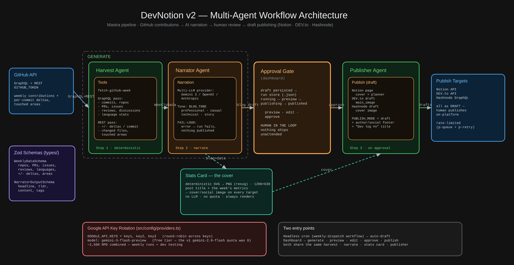

# GitPulse

A 3-agent [Mastra](https://mastra.ai) pipeline that transforms your weekly GitHub contributions into blog posts on **Notion** and **DEV.to** — fully automated via CI. Built for the [DEV.to x Notion MCP Challenge](https://dev.to/challenges/notion-2026-03-04).



## What It Does

Every Sunday (or on-demand via CI), GitPulse:

1. **Harvests** your GitHub activity via GraphQL — commits, PRs, issues, reviews, discussions, language stats, and contribution streak
2. **Narrates** the data into a first-person blog post using Gemini — casual, playful, written as the developer
3. **Publishes** to two platforms:
   - **Notion** — planner-style page with stats tables, repo breakdowns, PR/issue/review tables, and the full blog post
   - **DEV.to** — draft article with canonical URL pointing back to Notion

## Architecture

| Step | Agent | LLM? | What it does |
|------|-------|------|--------------|
| Harvest | `github-harvest-agent` | No | Fetches weekly GitHub data via GraphQL (deterministic) |
| Narrate | `narrator-agent` | Yes (Gemini) | Writes a first-person blog post from the data |
| Publish | `publisher-agent` | No | Creates Notion page + DEV.to draft via direct APIs |

The pipeline only uses an LLM where it adds value (narration). Harvest and publish are deterministic — no token overhead, no hallucination risk.

### MCP Integration

The publisher agent integrates with the [Notion MCP Server](https://github.com/makenotion/notion-mcp-server) (`@notionhq/notion-mcp-server`) via `@mastra/mcp`, giving it the full Notion API surface in the Mastra playground. The automated workflow uses direct API calls for reliability, with the Notion Markdown Content API for rich page content.

### Narration Fallback Chain

1. **Gemini generation** — YAML frontmatter + markdown blog post
2. **Deterministic fallback** — builds a basic post from raw data (zero LLM dependency)

A blog post is always generated, even if the LLM is unavailable.

## Quick Start

### Prerequisites

- Node.js 22+
- pnpm
- GitHub personal access token (`ghp_`)
- Google AI Studio API key(s) ([get here](https://aistudio.google.com))
- Notion integration token + parent page ID ([setup guide](https://developers.notion.com/docs/create-a-notion-integration))
- DEV.to API key (optional — [Settings → Extensions → API Keys](https://dev.to/settings/extensions))
<!-- 
### Setup

```bash
git clone https://github.com/yashksaini-coder/GitPulse.git
cd GitPulse
pnpm install
```

Copy `.env.example` to `.env.local` and fill in your keys:

```bash
cp .env.example .env.local
```

### Run

```bash
# Run for the current week
pnpm dev

# Run for a specific week
pnpm dev -- --week=2026-03-16

# Open the Mastra playground (agent testing UI)
pnpm playground
```
-->

### CI (GitHub Actions)

The workflow runs automatically every Sunday at 08:00 UTC. You can also trigger it manually:

**Actions → Weekly Blog Dispatch → Run workflow** (optionally provide a `YYYY-MM-DD` week start)

Required secrets: `GH_TOKEN`, `GH_USERNAME`, `GOOGLE_API_KEYS`, `NOTION_TOKEN`, `NOTION_PARENT_PAGE_ID`, `DEVTO_API_KEY`

## Blog Tone Profiles

Set `BLOG_TONE` in your `.env.local` (default: `casual`):

| Tone | Style |
|------|-------|
| `casual` | First-person, playful, OSS-passionate dev energy |
| `professional` | Confident builder, clear and direct |
| `technical` | Deep-dive, architecture-focused, conversational |
| `storytelling` | Personal dev diary, honest and engaging |

## Notion Page Format

Each week creates a planner-style Notion page with:

- **Published Links** — Notion page + DEV.to draft edit link
- **Week at a Glance** — stats table (commits, PRs, issues, reviews, lines changed)
- **Active Repositories** — repo table with commits, language, changes
- **Pull Requests / Issues / Reviews / Discussions** — structured tables
- **Languages** — top languages by commit count
- **Blog Post** — the full narrated content

## Blog Log

| Week | Headline | Repos | Commits | PRs | Issues | Reviews | Lines Changed | Languages | Notion | DEV.to |
|------|----------|-------|---------|-----|--------|---------|---------------|-----------|--------|--------|


## Tech Stack

- **[Mastra](https://mastra.ai)** — Agent framework with workflows, tools, and MCP support
- **[Gemini](https://aistudio.google.com)** — LLM provider (key rotation for rate limits)
- **[Notion API](https://developers.notion.com)** — Page creation + Markdown Content API
- **[Notion MCP Server](https://github.com/makenotion/notion-mcp-server)** — Model Context Protocol integration
- **[DEV.to API](https://developers.forem.com/api)** — Draft article publishing
- **GitHub Actions** — Weekly cron + manual dispatch CI