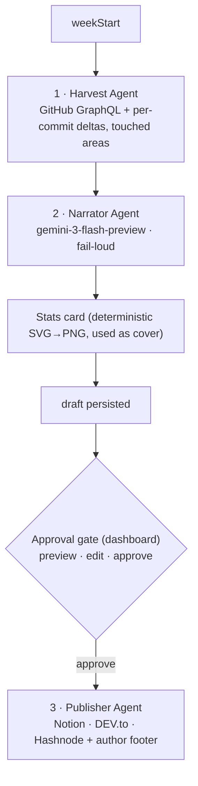

*This is a submission for the [GitHub Finish-Up-A-Thon Challenge](https://dev.to/challenges/github-2026-05-21)*

> **[Editor's note — delete before publishing]** Search for **`REPLACE_WITH_IMAGE_URL`** and swap each one for a real image URL (drag a file into the DEV.to editor to host it, then paste the URL). Set a `cover_image:` too — the weekly stats card works well as the cover. In *"My Experience with GitHub Copilot"* keep only what matches your actual usage. Everything else is finished prose.

## What I Built

Every Monday standup, someone asks the same question: *"What did you work on last week?"* And for years my honest answer was a shrug and a scroll through commit history I could barely parse. Multiply that by every standup, every quarterly review, every *"so what have you been building?"* from a friend — the cost of not having a readable record of your own work compounds quietly.

So in March I built **[DevNotion](https://github.com/yashksaini-coder/DevNotion)** — a [Mastra](https://mastra.ai) pipeline of specialist agents that harvests a week of my GitHub activity, narrates it into a first-person blog post, and publishes it to Notion and DEV.to. It won **$500** in the Notion MCP Challenge. And then, like a lot of hackathon projects, it sat.

It *worked*. But every week I used it, I felt the gaps. It was locked to a single LLM. It published whatever it generated the instant it generated it — no preview, no edit, no undo. And when I reopened the repo for the Finish-Up-A-Thon, the **very first run failed in the most embarrassing way I can imagine** — which turned out to be the perfect place to begin.

**DevNotion v2** is the version I should have shipped the first time: a pipeline that **generates a draft, shows it to you, lets you edit it, and only publishes when you approve** — backed by multiple LLM providers, three publishing targets, a deterministic stats-card cover, far richer data, and a real test suite. Seven focused phases took it from *runs* to *finished*: 51 tests, three interchangeable model providers, a one-command setup wizard, and — most importantly — a failure mode that protects my reputation instead of risking it.

The one idea behind the whole rebuild: *a tool that writes in your voice and publishes under your name has to be trustworthy before it's convenient.*

## Demo

**Repo:** [github.com/yashksaini-coder/DevNotion](https://github.com/yashksaini-coder/DevNotion)


Three specialist agents, with generation and publishing deliberately split by a human approval gate:



Each agent has a narrow, testable remit. **Harvest** is pure data — two bounded GraphQL/REST passes over a week of activity, zero LLM. **Narrate** is the only model call: it turns that data into a first-person post in your chosen tone. **Publish** is deterministic plumbing — Notion page, DEV.to draft, optional Hashnode draft, the stats-card cover, and the author footer. Between narrate and publish sits the human gate, which is the entire reason v2 exists.

The design rule that's held since v1: **only use an LLM where it earns its keep.** Harvesting GitHub data, rendering the stats card, and pushing to each platform are all deterministic code — no token cost, no rate limits, and crucially *no hallucination surface*. The model gets exactly one job, narration, where judgment and voice actually matter; every number, link, and timestamp around it comes from code that can be unit-tested. That boundary is the reason the output is safe to publish under my name without re-reading every figure.

In practice the loop is quick. I trigger a run — on a schedule, or by hand from the dashboard — and the harvest and narrator produce a draft in a few seconds. It lands marked **Preview Ready**, never published. I skim it, fix a phrase or two in the in-browser editor, and hit **Approve & Publish**. Only then does anything leave my machine — and what leaves is a *draft* on each platform, not a live post.

## The Comeback Story

### Where v1 actually was

I like to think I left v1 in good shape. The first run of the revival corrected me immediately:

```text
Narrate step: LLM call failed: You exceeded your current quota …
  limit: 0, model: gemini-2.0-flash
Publish: Created Notion page: https://app.notion.com/…
Publish: Published DEV.to article: https://dev.to/…
```

Read it twice. Narration **failed** — and the pipeline **published anyway**. v1's well-intentioned "always produce a blog" fallback meant a quota error quietly shipped a bare stats stub to my real DEV.to account. For a tool whose entire job is to represent my work, that's the worst possible behavior.

That single log hid three distinct bugs:

1. **The wrong model was wired in.** The live workflow read a different config key than the one I'd been carefully setting, so it silently fell back to a *retired* `gemini-2.0-flash` whose free quota is now `0`. I was configuring a knob connected to nothing.
2. **Failure was silent.** A `try/catch` swapped in a deterministic stub and marched straight on to publishing.
3. **There was no gate.** Nothing in the entire system ever let me *look* before it went live.

And a quieter, more insidious one: a week of 13 direct commits reported **`+0/-0` lines changed**, because line stats were summed from pull requests only. The posts were technically accurate and completely lifeless.

What unsettled me most wasn't any single bug — it was that the *most damaging* one was the helpful one. The `try/catch` that fell back to a deterministic stub was added in v1 to guarantee a post always shipped. That kindness is precisely what turned a recoverable quota error into a published embarrassment. "Always succeed" is the wrong goal for a tool that speaks for you; "never lie" is the right one.

I rebuilt DevNotion in seven focused phases. Each one got a short spec, a written plan, an implementation, a code review, and a green test run before the next began — small, verifiable steps instead of one heroic rewrite. That discipline wasn't ceremony — it's the fail-loud principle applied to my own process: each phase had to *prove* itself (types clean, tests green) before the next was built on top, so a regression couldn't hide three phases deep. The order it took:

### Phase 1 — Make narration trustworthy

First, one source of truth for model selection, defaulting to `gemini-3-flash-preview` (which actually *has* a free tier). Then the change that matters most — **fail-loud narration**:

```typescript
// src/llm/narrate.ts
// FAIL-LOUD: throws on provider error or unparseable output. NEVER returns a
// deterministic fallback — the caller decides what to do with a failure.
export async function narrateBlog(provider, data, opts = {}) {
  const system = buildNarratorSystemPrompt(opts.tone ?? 'casual', opts.focusAreas);
  const prompt = `Generate a blog post from this GitHub contribution data:\n\n${JSON.stringify(data, null, 2)}`;

  const text = await provider.generate(prompt, {
    system,
    maxTokens: opts.maxTokens ?? 8192, // Gemini 3 is a thinking model — small budgets starve the answer
  });

  const parsed = parseFrontmatter(text);
  if (!parsed.success) throw new Error(`Narration failed: ${parsed.error}`);
  return parsed.data.blog;
}
```

If narration throws, the workflow step throws, the run is marked **failed**, and the publish step never runs. A quota error can no longer reach a single reader. (The old deterministic builder still exists — but it's now an explicit, manual escape hatch, never an automatic one.)

Trustworthy also meant not being hostage to one vendor's quota. v1 was Gemini-only; v2 routes every call through a tiny provider interface, so an outage or a quota wall on one model is a config change, not a rewrite:

```typescript
// src/llm/provider.ts — one interface, three interchangeable backends
export function createProvider(env: Env): LLMProvider {
  switch (env.LLM_PROVIDER) {
    case 'openai':    return createOpenAIProvider(env);
    case 'anthropic': return createAnthropicProvider(env);
    default:          return createGeminiProvider(env);
  }
}
```

The Gemini backend also round-robins across a comma-separated list of keys (`keys[keyIndex++ % keys.length]`) — three free keys spread the load to roughly 1,500 requests/day combined, comfortably above a weekly run plus a day of hacking. Swapping the entire brain of the pipeline is now a single environment variable.

### Phase 2 — Split generate from publish

This was the keystone, and it explains *why* v1 never had a preview. The old workflow welded harvest → narrate → publish into one chain whose output schema **dropped the blog body entirely**. There was nothing to preview because the content never survived the step boundary. The smoking gun was the workflow's own output type — it carried URLs and counts but no `content` field, so the draft died inside the step that created it. You can't bolt a preview screen onto an architecture that throws the content away; the split wasn't a feature layered on v1, it was the precondition for every other improvement.

v2 splits the pipeline in two. A `generate` phase produces a full, previewable draft and **stops**. A separate `publish` action runs only on approval, applying any edits you made:

```typescript
// src/server/routes/run.ts
// POST /run  → generates a draft, stores it, sets status "preview". Publishes NOTHING.
// POST /publish/:jobId → applies your edited markdown, then calls publishBlog().
```

That one architectural cut delivered three wins simultaneously: a safe failure mode, an editable in-browser preview, and run history that finally shows what was actually written. The publisher itself became a reusable function shared by both the dashboard and the cron path:

```typescript
// src/publish/publish-content.ts — one publisher, used by cron AND the dashboard
export async function publishBlog(opts: {
  blog; weeklyData; publishMode: 'auto' | 'draft';
  images?: { statsCardPath?: string };
}): Promise<PublishResult> { /* notion → devto → hashnode → write planner + footer */ }
```

Holding it together is a small JSON-backed **run store** that doubles as the pipeline's state machine. Every run moves through an explicit lifecycle — `running → preview → publishing → published`, or `failed` — and that one record is what the dashboard lists, what the preview screen renders from, and what the publish step reads back when you approve. It's also where the `Dev log #n` counter lives, so the numbering stays sequential whether a post originates from the dashboard or the headless cron job: one ledger, two entry points.

### Phase 3 — Harvest the real diff

The `+0/-0` bug is gone. A bounded second GraphQL pass pulls each active repo's commit history — real additions/deletions, changed-file counts, and the **top directories you touched** — so the narrator can ground the story in specifics instead of generic verbs. The exact week that used to report nothing now reports:

```text
week 2026-05-27 → totals +2,252/-293
- DevNotion:        +2,220/-282, files=25, areas=[src/server, src/tools, bin]
- yashksaini-coder: +24/-3,      files=5,  areas=[assets, .github/workflows]
```

It's quota-safe by construction — hard caps on how many repos and commits it inspects, with per-commit best-effort isolation so one failure never sinks the harvest:

```typescript
// src/tools/github-commits.ts — bounded, best-effort changed-file harvest
for (const sha of shas) {
  try {
    const res = await fetch(`https://api.github.com/repos/${owner}/${name}/commits/${sha}`, { headers });
    if (!res.ok) continue;
    for (const f of (await res.json()).files ?? []) paths.push(f.filename);
  } catch {
    // skip this commit on any error — never sink the whole week
  }
}
```

The two-pass split is deliberate: GraphQL is efficient for breadth (a whole week across many repos in one query), while the per-commit file lists come from a handful of targeted REST calls — each cheap, each isolated, none able to take down the rest.

This was the single feedback theme from v1's readers: *commit titles are cryptic; the diff tells the story.* Now it does.

### Phase 4 — Sharper writing + an author footer

I tightened the narrator's instructions — character-led hooks instead of stat lines, an explicit *no stat-dumping* rule (the numbers live on the card; the prose shouldn't recite them), and guidance to lean on the new touched-areas data so a post can say "a week deep in `src/server`" rather than "made several changes." The tone is a knob — `casual`, `professional`, `technical`, or `storytelling` — but those guardrails hold across all four. Then I added a consistent author/social footer to every post on every platform, rendered from one config file:

```text
---
**Yash K Saini** — Engineer, building in public — AI/ML, low-level (Rust/C/C++), and open source.

[GitHub] · [X] · [LinkedIn] · [Portfolio]
```

It's applied at publish-build time, not by the narrator — so it can't be accidentally edited away in the preview, and Hashnode gets it for free.

The payoff shows in the titles. A recent live run opened with *"Bridging the Gap: TLS Interop, p2p Hardening, and Neovim Refinement"* — grounded in the directories I'd actually touched that week, not "This week I made 35 commits." That specificity is exactly what the touched-areas data buys.

### Phase 5 — The cover image

My first instinct was the obvious one: an AI **cover** via Nano Banana (`gemini-2.5-flash-image`), prompted from the week's headline. I wired it up — and discovered the free tier gives image generation a quota of `limit: 0`. It never produced a single cover. That probabilistic, rate-limited dependency was buying me nothing.

So I deleted it, and let a piece of code I already had do the job. The **deterministic stats card** — rendered from a hand-built SVG → PNG (via `@resvg/resvg-js`) with the week's *exact* numbers — is already exactly cover/OG dimensions, 1200×630. I just made it the cover:

```typescript
// src/images/stats-card.ts — the numbers come from code, never from a model
const stats = [
  [fmt(data.totalCommits), 'commits'],
  [`+${fmt(data.totalAdditions)}`, 'added'],
  [`-${fmt(data.totalDeletions)}`, 'removed'],
  // …
];
```

The card leads with the post title and the week's headline metrics — commits, PRs, reviews, lines added/removed, repos — and ships as the cover/social image on every target: DEV.to's `main_image`, the Hashnode cover, the Notion page cover. (The `Dev log #n` number stays on the *article* title, not the cover, so the banner is all title and numbers, and a long title wraps cleanly instead of running off the edge.) **Code** for the factual card means an LLM can never hallucinate `2,252` into `2,000`, and the cover went from *never working* to *always working* in the same change that deleted code: no API, no quota, no fallback path — it just renders. That's the rare refactor where the simplification and the quality win are the same move.

### Phase 6 — A dashboard worth screenshotting

The three dashboard routes had drifted into three slightly-different stylesheets. I unified them into a single design system — one set of design tokens, one page shell, shared components — and gave it a deliberate **Swiss / International Typographic** look: a tight type scale, a single orange accent, lots of structural whitespace. The whole dashboard is server-rendered HTML with no build step — it runs straight through `tsx` — which keeps the surface small and the dependency list short. Most of the polish went into the preview/edit view, because that screen *is* the pitch: it's where you read the draft, fix a sentence, and decide to ship.

### Phase 7 — Tests

**51 tests across 18 suites** now cover the frontmatter parser, the fail-loud path, the deterministic fallback, tag normalization, provider/model selection, publish-target selection, the diff aggregation, and the stats-card builder (including the cover's title-strip and wrap). They're fast (sub-two-second runs) and deliberately boring — the point is that the deterministic spine has a regression net, so a refactor like swapping the cover implementation can't quietly break publishing.

### Setup in one command

v1's onboarding was a `.env` scavenger hunt — copy the example, guess which keys you actually need, and find out what's missing only when a run crashes mid-flight. `npx devnotion init` replaces that with a guided wizard: it prompts for each credential, **validates it with a live API call** (a green check or a red error, right there in the terminal), and writes a correct `.env.local`. It's a small thing, but software that calls itself *finished* shouldn't make the first five minutes the hardest five.

### Before vs after

| | Before (v1) | After (v2) |
|---|---|---|
| Failure mode | silently published a stub | **fail-loud** — publishes nothing |
| Review | none — instant publish | **preview, edit, approve** |
| LLMs | Gemini only | Gemini / OpenAI / Anthropic |
| Publish targets | Notion + DEV.to | + Hashnode |
| Line stats | PR-only (`+0/-0` on commit weeks) | real per-commit deltas + touched areas |
| Cover image | none | Deterministic stats card, used as the cover |
| Setup | hand-edit `.env` | `npx devnotion init` wizard |
| Tests | a handful | 51 across 18 suites |

> **Before:** "It works, but you have to trust it blindly."
> **After:** "It works, and it gets out of your way — safely."

## Publishing responsibly (the research that turned into a feature)

Around phase five I nearly bolted on automatic publishing to more platforms. Then I did the boring, important thing first: I read the rules. The question I actually searched was simple — *"is automated/AI publishing even allowed here, and can it get my account restricted?"* — and the answers reshaped the design.

- **Medium** is a dead end for automation, on two counts. Its [publishing API was archived in 2023](https://github.com/Medium/medium-api-docs) (no new integration tokens), and its [AI content policy](https://help.medium.com/hc/en-us/articles/22576852947223-Artificial-Intelligence-AI-content-policy) gives undisclosed AI writing "Network Only" distribution and can remove it outright. An auto-posted AI dev-log is precisely what that policy targets — so Medium is off the roadmap by design, not by omission.
- **Hashnode** has a genuine [publishing API](https://apidocs.hashnode.com/), but its [Code of Conduct](https://hashnode.com/code-of-conduct) prohibits "automated or bulk posting" and self-promotion without contributing, and its [terms](https://hashnode.com/terms) allow account suspension at their discretion. A real weekly post is fine; blind, scheduled, multi-account auto-posting is the pattern they police.
- **DEV.to** is the friendliest to drafts and review, which is exactly the workflow I landed on.

The fix wasn't to publish less — it was to publish *honestly*:

- **Draft by default, human approval required.** Every platform now receives a *draft*; I review and edit it in the dashboard, then publish on-platform myself. Nothing ships unattended.
- **A disclosure footer** on every post — a small, bold **Generated by DevNotion**. No hiding the tool.
- **A `Dev log #n` title prefix**, so the series is honest about what it is.

The through-line is disclosure over cleverness: a reader — and each platform's moderation — can tell exactly what this is and who stands behind it. That's cheaper to build than an evasion, and far cheaper than a suspended account.

One search — *"what are the actual rules here?"* — turned a feature I'd have rushed into a design constraint that made the whole thing more defensible. "Finished" doesn't only mean it runs; it means it won't get your accounts restricted.

## My Experience with GitHub Copilot

Reviving a codebase you haven't opened in months is mostly *re-orientation* — you spend the first hours remembering your own decisions before you can improve any of them. That's exactly where AI pairing earned its place, and the wins were rarely whole functions; they were almost always *understanding*. A few moments stood out more than any autocomplete:

- **Diagnosing the silent bug.** The highest-value assist wasn't generated code — it was tracing *why* setting the model config changed nothing. Walking the two divergent code paths with an AI partner surfaced the split-brain config in minutes instead of an afternoon of `console.log` archaeology.
- **The provider abstraction.** Describing "one interface, swap Gemini / OpenAI / Anthropic" in plain English produced a clean factory I refined rather than wrote from a blank file.
- **Relearning an unfamiliar API.** Mastra's workflow primitives had shifted since I first used them. Rather than spelunking changelogs, I described the harvest → narrate → publish shape I wanted and let the assistant scaffold the `createStep`/`createWorkflow` calls, then corrected the schema wiring against the real types.
- **Knowing when to delete.** I started wiring an AI cover via the Nano Banana API and paired to figure out its quirks — Gemini image models return bytes via `result.files`, and you call `generateText`, not a dedicated image function. The genuinely useful assist came right after: confirming the free tier's image quota was `limit: 0`, which made the call to drop the whole thing and let the deterministic stats card be the cover obvious instead of stubborn.
- **Tests.** Generating the first pass of each unit test from the module's signature, then tightening the assertions by hand, is what made a 51-test suite cheap enough to actually write.


What changed most wasn't raw speed — it was *confidence flowing back into a cold codebase*. The AI didn't just complete lines; it helped me remember what the code did and decide where to take it next. That's the part of "finishing" nobody warns you about, and it's the part pairing helped most.

## Results & Validation

- **7 phases, shipped incrementally** — each verified against `tsc` and the test suite before the next.
- **51 tests / 18 suites, green.**
- The narration path was confirmed live on the free tier (`gemini-3-flash-preview`), the harvest fix verified on a real week (`+0/-0` → `+2,252/-293`), and the stats card rendered to a real 1200×630 PNG.
- **Proven end-to-end on real weeks.** I ran v2 against three separate January 2026 weeks; each produced a Notion page and a DEV.to draft with the deterministic stats card attached as the cover — verified straight from the DEV.to API, where `cover_image` resolved to the generated card for every post.

None of this is theoretical. The rebuild was verified the same way it was built — incrementally. Every phase ended with a clean `tsc` and a green suite before the next began; the failing first run became a passing one I watched end to end; and the final proof was mundane on purpose — three real weeks published as reviewable drafts, covers and all, with nothing shipped that I hadn't read first.

## What "finishing" actually meant

I started this thinking *finishing* meant features — more platforms, prettier output, an AI cover. Almost none of the work turned out to be that. The phases that mattered were the ones that made the tool **honest**: failing loudly instead of shipping a stub, showing me the draft before it went live, putting real diffs where guesses used to be, and reading each platform's rules before automating against them.

The clearest signal was how often "finishing" meant *deleting*. The AI cover came out. The silent fallback came out of the hot path. An entire config key that connected to nothing came out. The version that felt finished wasn't the one with the most code — it was the one I'd trust to post under my name while I wasn't watching.

## What's Next

- **The deterministic stats card is the cover** — no image quota, no API, always succeeds; one fewer moving part than the AI cover I tried and dropped.
- **Per-platform publish resilience** — today, one platform failing fails the whole run (surfaced and retryable, but all-or-nothing); isolating each target, so a Hashnode hiccup can't block a DEV.to draft, is the top v3 item.
- **Bidirectional Notion sync** — draft and edit in Notion, then push outward, so the review step can happen wherever you already work.
- **Attended weekly digests** — a Monday-morning summary with the generated draft linked, so approval is one click from your inbox.

The repo is [yashksaini-coder/DevNotion](https://github.com/yashksaini-coder/DevNotion): `npx devnotion init`, point it at a week, and watch the draft land in the dashboard *before* anything ships. If you try it, open an issue — I read them now, and "I read them now" is its own small proof the thing is finished. ⭐ it if the rebuild resonates.

---

*Built with [Mastra](https://mastra.ai), the [Vercel AI SDK](https://ai-sdk.dev), Gemini 3 Flash for narration, `@resvg/resvg-js` for the stats-card cover, and the [Notion](https://developers.notion.com) / [DEV.to](https://developers.forem.com/api) / [Hashnode](https://apidocs.hashnode.com/) APIs. By [Yash K Saini](https://yashksaini.vercel.app/) — [GitHub](https://github.com/yashksaini-coder) · [X](https://x.com/0xcrackedDev) · [LinkedIn](https://www.linkedin.com/in/yashksaini). Star it if it made you smile.*
