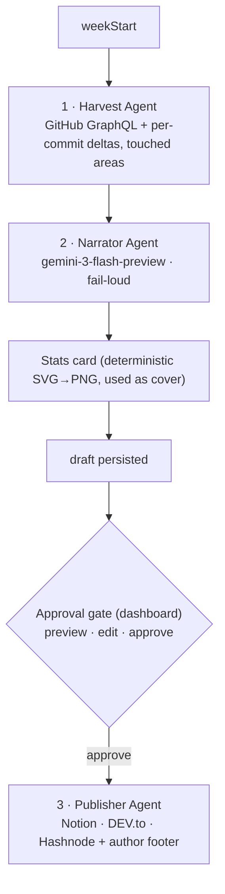

*This is a submission for the [GitHub Finish-Up-A-Thon Challenge](https://dev.to/challenges/github-2026-05-21)*

> **[Editor's note — delete before publishing]** The cover, the stats-card shot, the architecture diagram, the landing page, and the Copilot screenshot are already filled in. Two slots still say `REPLACE_WITH_IMAGE_URL` — the dashboard history and the preview/edit screen. Grab those from your running dashboard, drop them into the DEV.to editor, and paste the URLs. Trim *"My Experience with GitHub Copilot"* to what you actually did. The `` lines are DEV.to embeds — they turn into repo cards on the platform, so ignore how they look here.

## What I Built

Every Monday standup, someone asks: *"What'd you ship last week?"* And every Monday I freeze. Did I merge that PR Tuesday or Wednesday? Was the gnarly part in the harvest code or the publisher? I'd sit there scrolling my own commit history like it belonged to a stranger.

So back in March I built something to answer the question for me. **[DevNotion](https://github.com/yashksaini-coder/DevNotion)** — a [Mastra](https://mastra.ai) pipeline that reads a week of my GitHub activity, writes it up as a first-person blog post, and ships it to Notion and DEV.to. It won **$500** in the Notion MCP Challenge. Then I did what everyone does with a hackathon project: nothing, for two months.

Here's the thing, though. It worked, but I never fully trusted it. One LLM, no say in it. It published the instant it finished writing — no preview, no edit, no "hang on, let me read that first." And when I opened the repo back up for the Finish-Up-A-Thon, the very first run failed in the most embarrassing way I can think of. Honestly? Best thing that could've happened. It showed me exactly what "finish this" was supposed to mean.

**DevNotion v2** is the version I should've shipped the first time. It writes a draft, shows it to me, lets me edit it, and *only* publishes when I say go. Multiple LLM providers. Three publishing targets. A deterministic cover image, much better data, a real test suite. Seven phases, 51 tests, a one-command setup wizard — and, most of all, a failure mode that protects my name instead of betting it.

One idea ran under the whole rebuild: a tool that writes in your voice and posts under your name has to be trustworthy before it gets to be convenient.

## Demo

**Repo:** [github.com/yashksaini-coder/DevNotion](https://github.com/yashksaini-coder/DevNotion)




Three specialist agents, with generation and publishing deliberately split by a human approval gate:



Each agent does one thing and only one thing. **Harvest** is pure data — two quick GraphQL/REST passes over the week, no LLM anywhere near it. **Narrate** is the single model call: raw data goes in, a first-person post comes out, in whatever tone you picked. **Publish** is plumbing — a Notion page, a DEV.to draft, a Hashnode draft if you've set it up, plus the cover and the footer. And right in the middle, between writing and shipping, there's a human. That gate is the whole reason v2 exists.

The rule I kept from v1: an LLM only shows up where it earns its spot. Harvesting the data, drawing the stats card, pushing to each platform — that's all plain deterministic code. No tokens, no rate limits, no chance of the thing inventing a number. The model writes the prose. Everything around it is code I can unit-test. That's the only reason I'm comfortable letting it post under my name without re-reading every figure first.

In practice it's quick. I kick off a run (scheduled, or by hand from the dashboard) and a few seconds later there's a draft sitting there marked **Preview Ready**. Not published. I read it, fix a sentence or two right in the browser, hit **Approve & Publish**. *Then* it goes out — and even then it goes out as a draft on each platform, not a live post.

## The Comeback Story

### Where v1 actually was

I genuinely thought I'd left v1 in decent shape. The first run set me straight in about four seconds:

```text
Narrate step: LLM call failed: You exceeded your current quota …
  limit: 0, model: gemini-2.0-flash
Publish: Created Notion page: https://app.notion.com/…
Publish: Published DEV.to article: https://dev.to/…
```

Read it twice. The narration **failed** — and the thing **published anyway**. v1 had this well-meaning "always produce a blog" fallback, so a quota error quietly shipped a bare stats stub to my real DEV.to account. For a tool whose entire job is to represent my work? That's about the worst thing it could possibly do.

That one log was hiding three separate bugs:

1. **Wrong model, wired to nothing.** The live workflow read a different config key than the one I'd been carefully setting. So it quietly fell back to a *retired* `gemini-2.0-flash`, whose free quota is now `0`. I'd been turning a knob connected to thin air.
2. **The failure was silent.** A `try/catch` swapped in a deterministic stub and marched straight on to publishing.
3. **Nothing ever let me look.** No preview, no gate, no pause before it went live.

And a sneakier one underneath all that: a week with 13 direct commits reported **`+0/-0` lines changed**, because line stats were summed from pull requests only. The posts came out technically accurate and completely dead.

What actually bothered me wasn't any single bug. It was that the *worst* one was the helpful one. That `try/catch`-into-a-stub got added in v1 on purpose, to guarantee a post always shipped. And that good intention is exactly what turned a recoverable quota error into a published embarrassment. Turns out "always succeed" is the wrong goal for something that talks for you. "Never lie" is the right one.

So I rebuilt it in seven phases. Each one got a quick spec, a plan, the actual work, a review, and a green test run before I let myself start the next. Not ceremony — it's the fail-loud rule pointed at my own process. Every phase had to prove itself (types clean, tests green) before anything got stacked on top, so nothing could quietly rot three phases deep. Here's how it went.

### Phase 1 — Make narration trustworthy

First, one place to choose the model, defaulting to `gemini-3-flash-preview` (which, unlike the thing it replaced, actually has a free tier). Then the part that matters most — narration that **fails loud**:

```typescript
// src/llm/narrate.ts
// FAIL-LOUD: throws on provider error or unparseable output. NEVER returns a
// deterministic fallback — the caller decides what to do with a failure.
export async function narrateBlog(provider, data, opts = {}) {
  const system = buildNarratorSystemPrompt(opts.tone ?? 'casual', opts.focusAreas);
  const prompt = `Generate a blog post from this GitHub contribution data:\n\n${JSON.stringify(data, null, 2)}`;

  const text = await provider.generate(prompt, {
    system,
    maxTokens: opts.maxTokens ?? 8192, // Gemini 3 is a thinking model — small budgets starve the answer
  });

  const parsed = parseFrontmatter(text);
  if (!parsed.success) throw new Error(`Narration failed: ${parsed.error}`);
  return parsed.data.blog;
}
```

If narration throws, the step throws, the run is marked **failed**, and the publish step never runs. A quota error can't reach a single reader anymore. (The old deterministic builder is still in there — but now it's a manual escape hatch you reach for on purpose, never something that fires on its own.)

Trustworthy also meant not living and dying by one vendor's quota. v1 was Gemini or nothing. v2 runs every call through a tiny provider interface, so an outage or a quota wall is a config change instead of a rewrite:

```typescript
// src/llm/provider.ts — one interface, three interchangeable backends
export function createProvider(env: Env): LLMProvider {
  switch (env.LLM_PROVIDER) {
    case 'openai':    return createOpenAIProvider(env);
    case 'anthropic': return createAnthropicProvider(env);
    default:          return createGeminiProvider(env);
  }
}
```

The Gemini side also rotates through a comma-separated list of keys (`keys[keyIndex++ % keys.length]`). Three free keys gets you somewhere around 1,500 requests a day between them, which is plenty for a weekly run plus a day of messing around. Swapping the whole brain of the pipeline is one env var now.

### Phase 2 — Split generate from publish

This was the keystone, and it's the reason v1 never had a preview to begin with. The old workflow welded harvest → narrate → publish into one chain, and that chain's output schema **dropped the blog body on the floor**. There was nothing to preview because the content never survived the handoff between steps. The smoking gun was the workflow's own output type: it carried URLs and counts and no `content` field at all. You can't bolt a preview screen onto something that throws the draft away. So splitting it wasn't a nice-to-have stacked on v1. It was the thing that had to happen before anything else could.

v2 cuts the pipeline in half. A `generate` phase makes a full, previewable draft and **stops**. A separate `publish` step runs only when you approve, edits and all:

```typescript
// src/server/routes/run.ts
// POST /run  → generates a draft, stores it, sets status "preview". Publishes NOTHING.
// POST /publish/:jobId → applies your edited markdown, then calls publishBlog().
```

That one cut bought three things at once: a safe failure mode, an editable preview in the browser, and run history that finally shows what actually got written. And the publisher turned into a single function that both the dashboard and the cron job call:

```typescript
// src/publish/publish-content.ts — one publisher, used by cron AND the dashboard
export async function publishBlog(opts: {
  blog; weeklyData; publishMode: 'auto' | 'draft';
  images?: { statsCardPath?: string };
}): Promise<PublishResult> { /* notion → devto → hashnode → write planner + footer */ }
```

Tying it together is a little JSON-backed **run store** that's basically the pipeline's state machine. Every run walks a fixed path — `running → preview → publishing → published`, or `failed` — and that one record is what the dashboard lists, what the preview renders from, and what publish reads back when you hit approve. It's also where the `Dev log #n` counter lives, so the numbers stay in order whether a post came from the dashboard or the cron job. One ledger, two doors in.

### Phase 3 — Harvest the real diff

The `+0/-0` bug is dead. A second, bounded GraphQL pass walks each active repo's commits — real additions and deletions, changed-file counts, and the **directories you actually touched** — so the narrator can talk about specifics instead of waving its hands. That same week that used to report nothing now says:

```text
week 2026-05-27 → totals +2,252/-293
- DevNotion:        +2,220/-282, files=25, areas=[src/server, src/tools, bin]
- yashksaini-coder: +24/-3,      files=5,  areas=[assets, .github/workflows]
```

It's quota-safe on purpose: hard caps on how many repos and commits it'll look at, and every commit wrapped in its own `try/catch` so one bad fetch can't sink the whole week:

```typescript
// src/tools/github-commits.ts — bounded, best-effort changed-file harvest
for (const sha of shas) {
  try {
    const res = await fetch(`https://api.github.com/repos/${owner}/${name}/commits/${sha}`, { headers });
    if (!res.ok) continue;
    for (const f of (await res.json()).files ?? []) paths.push(f.filename);
  } catch {
    // skip this commit on any error — never sink the whole week
  }
}
```

Two passes, on purpose. GraphQL is great for breadth — a whole week across a pile of repos in one query. The per-commit file lists come from a few targeted REST calls instead, each one cheap and each one isolated. This was the single thing v1's readers kept telling me: commit titles are cryptic, the diff is where the story actually is. Now it's in there.

### Phase 4 — Sharper writing + an author footer

I tightened the narrator's instructions. Lead with a character or a moment, not a stat line. A hard *no stat-dumping* rule — the numbers live on the card, the prose doesn't need to recite them. And lean on the new touched-areas data, so a post can say "a week deep in `src/server`" instead of "made several changes." You still get to pick the tone — `casual`, `professional`, `technical`, `storytelling` — but those rules hold no matter which one you choose. Then I gave every post, on every platform, the same author footer, built from one config file:

```text
---
**Yash K Saini** — Engineer, building in public — AI/ML, low-level (Rust/C/C++), and open source.

[GitHub] · [X] · [LinkedIn] · [Portfolio]
```

It gets stamped on at publish time, not written by the narrator. So you can't accidentally delete it in the preview, and Hashnode gets it for free.

You can see the difference in the titles. One real run opened with *"Bridging the Gap: TLS Interop, p2p Hardening, and Neovim Refinement"* — pulled straight out of the directories I'd been living in that week. Not "This week I made 35 commits." That's what the touched-areas data buys you.

### Phase 5 — The cover image

My first instinct was the obvious one: an AI cover. Nano Banana (`gemini-2.5-flash-image`), prompted off the week's headline. I wired the whole thing up… and found out the free tier gives image generation a quota of `limit: 0`. It never produced a single cover. So I was carrying a flaky, rate-limited dependency that did, in practice, nothing.

So I ripped it out and used something I already had. The **stats card** — a hand-built SVG rendered to PNG with `@resvg/resvg-js`, showing the week's *exact* numbers — happens to already be 1200×630, which is cover/OG size. So I just made it the cover:

```typescript
// src/images/stats-card.ts — the numbers come from code, never from a model
const stats = [
  [fmt(data.totalCommits), 'commits'],
  [`+${fmt(data.totalAdditions)}`, 'added'],
  [`-${fmt(data.totalDeletions)}`, 'removed'],
  // …
];
```

It leads with the post title and the headline numbers (commits, PRs, reviews, lines, repos) and becomes the cover everywhere: DEV.to's `main_image`, the Hashnode cover, the Notion page cover. The `Dev log #n` bit stays on the article title, not the card, so the banner is all title and stats, and a long title wraps instead of running off the edge. Because the card is built from code, no model can ever round `2,252` down to "about 2,000." And here's the bit I liked: ripping out the AI cover made the feature *more* reliable, not less. It went from never working to always working in the same commit that deleted code. No API, no quota, no fallback path. It just renders.

### Phase 6 — A dashboard worth screenshotting

My three dashboard routes had quietly drifted into three slightly-different stylesheets. I pulled them back into one design system — shared tokens, one shell, shared components — and gave it a deliberate **Swiss / International Typographic** feel: tight type scale, one orange accent, lots of breathing room. It's all server-rendered HTML, no build step, straight through `tsx`, which keeps the footprint tiny and the dependency list short. Most of the effort went into the preview/edit screen, because honestly that screen *is* the product. It's where you read the draft, tweak a line, and decide to ship.

### Phase 7 — Tests

**51 tests across 18 suites** now cover the frontmatter parser, the fail-loud path, the deterministic fallback, tag normalization, provider and model selection, publish-target selection, the diff aggregation, and the stats-card builder (cover title-strip and wrap included). They run in under two seconds and they're deliberately boring. The point isn't cleverness — it's a regression net under the deterministic spine, so something like swapping out the cover implementation can't quietly break publishing.

### Setup in one command

v1's setup was a `.env` scavenger hunt: copy the example, guess which keys you actually need, find out you missed one when a run blows up halfway through. `npx devnotion init` is a wizard instead. It asks for each credential, **checks it with a live API call** (green check or red error, right there in the terminal), and writes a clean `.env.local`. Small thing. But something that calls itself *finished* shouldn't make the first five minutes the worst five.

### Before vs after

| | Before (v1) | After (v2) |
|---|---|---|
| Failure mode | silently published a stub | **fail-loud** — publishes nothing |
| Review | none — instant publish | **preview, edit, approve** |
| LLMs | Gemini only | Gemini / OpenAI / Anthropic |
| Publish targets | Notion + DEV.to | + Hashnode |
| Line stats | PR-only (`+0/-0` on commit weeks) | real per-commit deltas + touched areas |
| Cover image | none | Deterministic stats card, used as the cover |
| Setup | hand-edit `.env` | `npx devnotion init` wizard |
| Tests | a handful | 51 across 18 suites |

> **Before:** "It works, but you have to trust it blindly."
> **After:** "It works, and it gets out of your way — safely."

## Publishing responsibly (the research that turned into a feature)

Around phase five I almost bolted on auto-publishing to a couple more platforms. Then I did the boring thing first and actually read the rules. The question I typed into the search bar was blunt: *"is automated/AI publishing even allowed here, and can it get my account restricted?"* The answers ended up reshaping the design.

- **Medium** is a dead end for automation, on two counts. Its [publishing API was archived in 2023](https://github.com/Medium/medium-api-docs) (no new integration tokens), and its [AI content policy](https://help.medium.com/hc/en-us/articles/22576852947223-Artificial-Intelligence-AI-content-policy) gives undisclosed AI writing "Network Only" distribution and can pull it outright. An auto-posted AI dev-log is exactly what that policy is aimed at — so Medium's off the roadmap by design, not by accident.
- **Hashnode** has a real [publishing API](https://apidocs.hashnode.com/), but its [Code of Conduct](https://hashnode.com/code-of-conduct) bans "automated or bulk posting" and self-promotion without contributing, and its [terms](https://hashnode.com/terms) let them suspend accounts at their discretion. A genuine weekly post is fine. Blind, scheduled, multi-account auto-posting is the pattern they're watching for.
- **DEV.to** is the friendliest to drafts and review, which is exactly the workflow I landed on anyway.

The fix wasn't to publish *less*. It was to publish honestly:

- **Draft by default, human approval required.** Every platform gets a *draft*; I review and edit it in the dashboard, then publish on-platform myself. Nothing ships unattended.
- **A disclosure footer** on every post — small, bold, **Generated by DevNotion**. No hiding the tool.
- **A `Dev log #n` title prefix**, so the series is honest about what it is.

The thread through all of it is disclosure over cleverness. A reader — and a platform's moderation team — can tell exactly what this is and whose name is on it. That's cheaper than building some workaround, and a lot cheaper than getting an account suspended.

That one search turned a feature I'd have rushed into a constraint that made the whole thing more defensible. "Finished" doesn't just mean it runs. It means it won't get your accounts pulled.

## My Experience with GitHub Copilot

Reopening a codebase you haven't touched in months is mostly just remembering. You spend the first few hours working out why past-you did what they did before you can change any of it. That's where pairing with AI actually paid off, and it was almost never "write this function." It was "help me understand this again." A few moments stuck with me more than any autocomplete:

- **Diagnosing the silent bug.** The most useful assist wasn't generated code — it was tracing *why* setting the model config changed nothing. Walking the two divergent code paths with an AI partner surfaced the split-brain config in minutes, instead of an afternoon of `console.log` archaeology.
- **The provider abstraction.** Describing "one interface, swap Gemini / OpenAI / Anthropic" in plain English got me a clean factory I refined, instead of writing it from a blank file.
- **Relearning an unfamiliar API.** Mastra's workflow primitives had shifted since I first used them. Rather than spelunking changelogs, I described the harvest → narrate → publish shape I wanted, let the assistant scaffold the `createStep`/`createWorkflow` calls, then fixed the schema wiring against the real types.
- **Knowing when to delete.** I started wiring an AI cover via the Nano Banana API and paired to figure out its quirks — Gemini image models return bytes via `result.files`, and you call `generateText`, not some dedicated image function. The genuinely useful assist came right after: confirming the free tier's image quota was `limit: 0`, which made dropping the whole thing the obvious call instead of a stubborn one.
- **Tests.** Generating the first pass of each unit test from the module's signature, then tightening the assertions by hand, is what made a 51-test suite cheap enough to actually write.


The thing that changed most wasn't speed. It was confidence coming back into a cold codebase. It didn't just finish my lines — it helped me remember what the code did and figure out where to take it next. Nobody warns you that's the hard part of "finishing" something. That's the part pairing helped with most.

## Results & Validation

- **7 phases, shipped incrementally** — each verified against `tsc` and the test suite before the next.
- **51 tests / 18 suites, green.**
- The narration path was confirmed live on the free tier (`gemini-3-flash-preview`), the harvest fix verified on a real week (`+0/-0` → `+2,252/-293`), and the stats card rendered to a real 1200×630 PNG.
- **Proven end-to-end on real weeks.** I ran v2 against three separate January 2026 weeks; each produced a Notion page and a DEV.to draft with the deterministic stats card attached as the cover — verified straight from the DEV.to API, where `cover_image` resolved to the generated card for every post.

None of this is theoretical. The rebuild got verified the same way it got built — incrementally. Every phase ended with a clean `tsc` and a green suite before the next one started. The failing first run became a passing one I watched run end to end. And the final proof was deliberately mundane: three real weeks, published as reviewable drafts, covers and all, with nothing shipped that I hadn't read first.

## What "finishing" actually meant

I came into this assuming "finishing" meant features. More platforms, nicer output, an AI cover. Almost none of it was that. The phases that actually mattered were the ones that made the tool **honest** — failing loud instead of shipping junk, showing me the draft before it went live, putting real diffs where guesses used to be, reading each platform's rules before automating against them.

And the clearest tell? How often "finishing" turned out to mean *deleting*. The AI cover, gone. The silent fallback, out of the hot path. A whole config key wired to nothing, gone. The version that finally felt done wasn't the one with the most code. It was the one I'd trust to post under my name while I wasn't looking.

## What's Next

- **The deterministic stats card is the cover** — no image quota, no API, always succeeds; one fewer moving part than the AI cover I tried and dropped.
- **Per-platform publish resilience** — right now, one platform failing fails the whole run (it's surfaced and retryable, but it's all-or-nothing). Isolating each target, so a Hashnode hiccup can't block a DEV.to draft, is the top v3 item.
- **Bidirectional Notion sync** — draft and edit in Notion, then push outward, so the review can happen wherever you already work.
- **Attended weekly digests** — a Monday-morning summary with the draft linked, so approving it is one click from your inbox.

The repo is [yashksaini-coder/DevNotion](https://github.com/yashksaini-coder/DevNotion): `npx devnotion init`, point it at a week, and watch the draft land in the dashboard *before* anything ships. If you try it, open an issue — I read them now, and "I read them now" is its own small proof the thing is finished. ⭐ it if the rebuild resonates.



**Connect:** [GitHub](https://github.com/yashksaini-coder) · [X](https://x.com/0xcrackedDev) · [LinkedIn](https://www.linkedin.com/in/yashksaini) · [Portfolio](https://yashksaini.vercel.app/)

---

*Built with [Mastra](https://mastra.ai), the [Vercel AI SDK](https://ai-sdk.dev), Gemini 3 Flash for narration, `@resvg/resvg-js` for the stats-card cover, and the [Notion](https://developers.notion.com) / [DEV.to](https://developers.forem.com/api) / [Hashnode](https://apidocs.hashnode.com/) APIs. By [Yash K Saini](https://yashksaini.vercel.app/) — [GitHub](https://github.com/yashksaini-coder) · [X](https://x.com/0xcrackedDev) · [LinkedIn](https://www.linkedin.com/in/yashksaini). Star it if it made you smile.*
